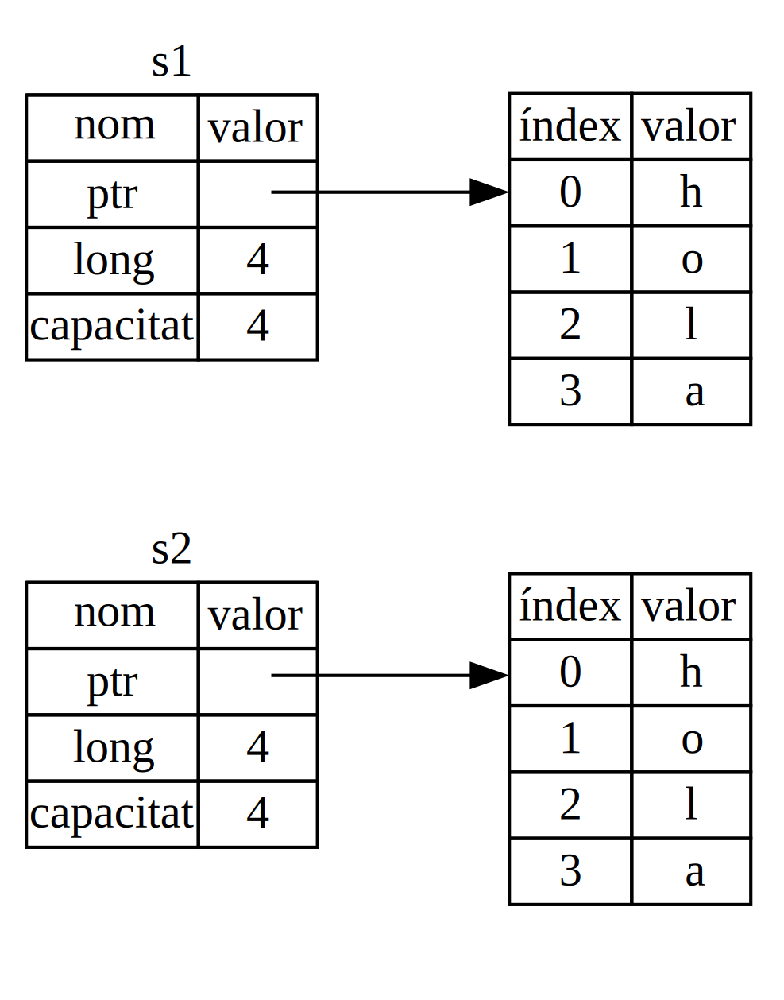

## Què és *Ownership*?

El mecanisme de pertinença o *Ownership* és un conjunt de regles que governen
com un programa en Rust gestiona la memòria. Tots els programes han de manegar
la manera en que fan servir la memòria de l'ordinador quan s'executen. Alguns
llenguatges disposen de recol·lector d'escombraries (*garbage collector*) que
se n'encarrega de gestionar memòria que ja no està en ús per part del programa.
En altres llenguatges, són els programadors els que han de reservar i alliberar
memòria explícitament. Rust fa servir una tercera opció: la memòria es
gestionada per un sistema de pertinença, amb un conjunt de regles que comprova
el compilador. Quan troba que el programa viola una de les regles, no el
compila. Cap de les funcionalitats de *ownership* rellenteix l'execució del
programa.

Donat que el concepte de *ownership* és nou per molts desenvolupadors, sol
costar una mica acostumar-se'n. La bona notícia és que, a mida que guanyem
experiència amb Rust i les regles del sistema de pertinença, anirem trobant més
natural desenvolupar codi segur i eficient. Tingués paciència.

Un cop entenguem el *ownership*, disposarem d'una base sòlida per entendre les
característiques que fan de Rust, un llenguatge únic. En aquest capítol
aprendrem el concepte tot treballant amb exemples focalitzats en una estructura
de dades ben comuna: les cadenes de text o *strings*.

> ### Pila i monticle
>
> Molts llenguatges de programació no ens requereixen pensar massa sovint sobre
> la pila (*stack*) i el monticle (*heap*) Però en un llenguatge de sistemes
> com ara Rust, que un valor estigui a la pila o al monticle afecta en com el
> llenguatge es comporta i en perquè hem de prendre determinades decisions. Més
> tard en aquest capítol es descriurà una part del concepte de pertinença, en
> relació amb la pila i el monticle. Per aquesta raó, a continuació passarem a
> fer-ne una breu explicació.
>
> Tant la pila com el monticle són parts de la memòria disponible per que el
> nostre codi la faci servir en temps d'execució. Són estructurades, però, de
> manera diferent. La pila emmagatzema els valors en l'ordre en que els obté i
> els elimina en ordre invers. Aquesta estructura es descriu com *l'últim que
> entra és el primer que surt* i en anglès es sol coneixer com (*LIFO* - last
> in, first out). Pensem en una pila de plats. Quan hi afegim més plats, els
> col·loquem a dalt de tot de la pila, i quan en traiem, els agafem també del
> cim. Afegir i eliminar plats del mig o la base de la pila no funcionaria tan
> bé! Afegir dades a una pila es coneix com *push*, mentre que de treure'n en
> diem *pop*. Tots els elements que guardem en la pila han de tenir una mida
> coneguda en temps de compilació. Aquelles dades que puguin canviar de midda,
> no podran anar a la pila i caldrà guardar-les al monticle.
>
> El monticle és menys organitzat. Quan hi afegim dades, hem de demanar una
> certa quantitat d'espai. L'assignador de memòria troba un espai lliure en el
> monticle que sigui prou gran, el marca que està en ús, i retorna un *punter*
> que correspon a l'adreça de memòria d'aquella posició. Aquest procés es
> coneix com *assignar al monticle* i, de vegades s'abrevia amb simplement
> *assignar* (afegir valors a la pila no es considera assignar). Donat que el
> punter al monticle té una mida fixa coneguda, podem emmagatzemar-lo a la
> pila, però quan volem aconseguir el valor al que apunta, hem de *seguir* el
> punter. Pensem en com aconseguim lloc a un restaurant. En entrar, demanem
> lloc pel nombre de persones que composa el nostre grup. Llavors el cambrer
> ens troba una taula buida amb prou espai per seure tot el grup. Finalment, el
> cambrer ens dirigeix a la taula trobada. Si algú del grup arriba tard, podrà
> preguntar on trobar-nos.
>
> Afegir a la pila és més ràpid que assignar al munticle, ja que no cal cercar
> per saber on col·locar-hi el nou valor. La nova posició és sempre el cim de
> la pila. En canvi, assignar espai al monticle requereix més feina ja que
> l'assignador ha de cercar un espai prou gran on guardar el valor i ha de
> registrar que està ocupat per posteriors assignacions.
>
> L'accés a les dades en el monticle també és més lent que en la pila, donat
> que cal seguir un punter per arribar-hi. Els processadors actuals van més
> ràpids quan no els cal saltar tant en memòria. Continuant l'analogia,
> considerem que el cambrer del restaurant ha d'agafar comandes de moltes
> taules. És més eficient apuntar totes les comandes d'una taula abans de
> moure's a la següent. Agafar primer una comanda de la taula A, passar a la B
> per una altra i tornar a la A un altre cop per una altra, seria un procés
> molt més lent. Per la mateixa raó, el processador fa millor la seva feina si
> treballa amb dades que es troben a prop d'altres dades, com ara a la pila, en
> comptes de més lluny, com passa al monticle.
>
> Quan el nostre codi crida una funció, els valors que es passen a aquesta
> funció, incloent potencialment punters a dades al monticle, i les variables
> locals de la funció, són afegits al cim de la pila. Quan la funció ha
> finalitzat, aquests valors són eliminats de la pila.
>
> El mecanisme de *ownership* se n'encarrega de portar la comptabilitat de
> quines parts del codi fan servir quines dades al monticle, minimitzant la
> quantitat de dades duplicades al monticle i alliberant-hi espai que ja no es
> fa servir, de manera que no ens quedem sense espai. Un cop entenguem el
> mecanisme de pertinença, no ens caldrà pensar en la pila ni el monticle tant
> sovint. Saber, però, que el principal objectiu del *ownership* és gestionar
> les dades del monticle, ens ajuda a explicar perquè funciona de la manera que
> ho fa.

### Regles de pertinença

En primer lloc, fem una ullada a les regles de pertinença. Mantinguem aquestes
regles al cap així anem passant pels diferents exemples que vindran:

* Cada valor en Rust té un *propietari* (*owner*).
* Només pot haver un propietari a cada moment.
* Quan el propietari mor (queda fora de l'àmbit), el valor serà eliminat.

### Àmbit de les variables

A partir d'ara, com que ja hem vist la sintaxi bàsica d'un programa en Rust, a
partir d'ara ometrem el `fn main() {` dels exemples de codi. Així, si vas
provant-los, recorda afegir-los el `main`. Així els exemples apareixeran una
mica més concisos, permetent-nos focalitzar en els detalls de l'exemple.

Com a primer exemple de pertinença, considerarem l'*àmbit* (en anglès *scope*)
d'algunes variables. L'àmbit és l'interval dins del programa en que un element
és vàlid. Per exemple:

```rust
let s = "hola";
```

La variable `s` fa referència a un literal de text. És a dir, el valor de la
cadena de text estarà codificat directament en el codi del nostre programa. La
variable és vàlida des del moment en que està declarada fins que finalitza
l'àmbit actual. El llistat 4-1 mostra un programa amb comentaris indicant on
serà vàlida la variable `s`.

```rust
{{#rustdoc_include ../listings/ch04-understanding-ownership/listing-04-01/src/main.rs:here}}
```

<span class="caption">Llistat 4-1: Una variable i l'àmbit en què és vàlida</span>

En altres paraules, hi ha dos punts de temps importants a considerar:

* Quan `s` *entra* en l'àmbit, és vàlida.
* Es manté vàlida fins que *surt* de l'àmbit.

Ara per ara, la relació entre àmbits i la validesa de les variables és similar
a la d'altres llenguatges de programació. Basant-nos en aquest coneixement,
continuarem aprofundint en el concepte amb la introducció del tipus `String`.

### El tipus `String`

Com a exemple d'aplicació de les regles de pertinença, necessitem un tipus de
dades que sigui més complex que aquells que hem vist a la secció [“Tipus de
dades”][data-types]<!-- ignore --> al capítol 3. Els tipus que hem vist fins
ara tenen mida coneguda, poden ser emmagatzemats a la pila i eliminats
d'aquesta quan finalitza el seu àmbit. També poden ser copiats de manera
trivial per crear-ne una nova instància independent de l'anterior, si una altra
part del codi requereix fer servir el mateix valor en un altre àmbit. Ara volem
considerar un tipus de dades que sigui emmagatzemat al montícle i, així,
explorar com sap Rust quan alliberar aquestes dades, `String` és genial per
aquest objectiu.

De moment ens concentrarem en les parts de `String` relacionades amb la
pertinença Aquests aspectes també són vàlids per altres tipus de dades
complexos, ja siguin inclosos a la llibreria estàndard o creats per nosaltres.
Tractarem el tipus `String` en més profunditat al [Capítol 8][ch8]<!-- ignore
-->.

Ja hem conegut els literals de text, en els que un valor de tipus String apareix codificat directament al nostre programa.
Els literals de text són convenients però no són adequats per totes les situacions en les que podem voler usar text.
Una de les raons és que són immutables. Una altra és que no tots els valors de
tipus string poden conèixer quan escrivim el nostre codi. Per exemple, què
passaria si volguessim obtenir l'entrada dels nostres usuaris i
emmagarzemar-la?
Per situacions com aquesta, Rust disposa d'un segon tipus de cadenes de text, anomenat `String`. 
Aquest tipus gestiona les dades assignades al montícle i, com a tal, és capaç d'emmagatzemar una cadena de text de llargària desconeguida en temps de compilació.
És possible crear un `String` a partir d'un literal de text, fent servir la funció `from`, de la següent manera:

```rust
let s = String::from("hola");
```

Els dos punts dobles `::` és un operador que ens permet gestionar l'espai de
noms a partir de la cadena de text, en comptes de requerir-nos alguna funció
especial com ara `string_from`. Tractarem aquesta sintaxi més endavant, a la
secció [“Síntaxi del mètode”][method-syntax]<!-- ignore --> del capítol, així
com de l'ús d'espais de noms a [“Camins per referir-nos a un element en l'arbre
de mòduls”][paths-module-tree]<!-- ignore --> al capítol 7.

Aquesta classe de text **és** mutable:

```rust
{{#rustdoc_include ../listings/ch04-understanding-ownership/no-listing-01-can-mutate-string/src/main.rs:here}}
```

Així, quina és la diferència? Per què podem modificar un valor de tipus
`String` però no de literal de text? La diferència rau en com aquests dos tipus
són gestionats en memòria.

### Memòria i assignació

Coneixem els continguts d'un literal de text en temps de compilació. Per
aquesta raó, el text pot ser inclós directament a l'executable final. Per
aquesta raó els literals són ràpids i eficients. Aquestes característiques
tenen com a preu que els literals han de ser immutables. Malauradament no podem
reservar un espai indeterminat de memòria dins l'executable, per cada peça de
text de la que no coneixem la mida en temps d'execució i, a sobre, quan aquesta
pot canviar durant l'execució del programa.

〜

Per a poder oferir la possibilitat de modificar i ampliar una peça de test, el
valor del tipus `String` ha de ser guardat al monticle, durant l'execució. Això
implica:

* L'assignador de memòria ha de reservar l'espai en temps d'execució.
* Necessitem alguna manera de retornar aquesta memòria a l'assignador, un cop
  ja no ens cal el nostre `String`.

La primera part la realitzem nosaltres quan cridem a `String::from`. La seva
implementació reserva la memòria necessària. Tot plegat és quelcom força
universal en els llenguatges de programació.

La segona part, però, és diferent. En llenguatges amb un recol·lector
d'escombraries (*Garbage Collector* o *GC*), el GC va enregistrant i alliberant
la memòria, així deixa de ser usada, de manera que els programadors no ens
n'hem de preocupar. A la majoria dels llenguatges sense GC, un cop sabem que no
necessitem una variable, ens cal alliberar el seu espai explícitament, cosa que
històricament representa un problema complicat si es vol fer bé. Si oblidem
alliberar, estem malbaratant memòria. Si ho fem massa d'hora, tenim una
variable invàlida. Si ho fem més d'un cop sobre la mateixa memòria, també
suposa un error. Per fer-ho bé, ens cal alliberar exactament una vegada cada
espai que reservem.

Rust ho resol d'una altra manera: la memòria és automàticament retornada un cop
la variable a qui pertany, surt fora d'àmbit. A continuació veurem una versió
de l'exemple del llistat 4-1, tot usant un `String` en comptes d'un literal de
text.

```rust
{{#rustdoc_include ../listings/ch04-understanding-ownership/no-listing-02-string-scope/src/main.rs:here}}
```

Hi ha un moment natural en el que podem retornar la memòria del nostre
`String`: quan `s` surt de l'àmbit. Quan una variable surt d'àmbit, Rust crida
una funció especial per nosaltres. Aquesta funció s'anomena [`drop`][drop]<!--
ignore -->, i és el lloc on l'autor de `String` pot col·locar el codi per
retornar l'espai de memòria. Rust crida `drop` automàticament en el moment que
es tanca el claudàtor.

> Nota: En C++, aquest patró d'alliberament de recursos al final del temps de
> vida d'un element, és de vegades anomenat *l'adquisició del recurs és la
> inicialització* o, en anglès *Resource Acquisition Is Initialization* (RAII).
> La funció `drop` a Rust resultarà familiar a hom que hagi fet servir el patró RAII.

Aquest patró suposa un impacte profund en la manera en que escrivim codi en
Rust. Pot semblar simple ara mateix, però el comportament del codi pot ser
inesperat en situacions més complexes quan vulguem disposar de múltiples
variables usant les dades que hem reservat al monticle. Ara explorarem algunes
d'aquestes situacions.

<!-- Old heading. Do not remove or links may break. -->
<a id="ways-variables-and-data-interact-move"></a>

#### Variables i dades interaccionant amb *Move*

Hi ha diferents maneres en Rust en que múltiples variables interaccionen amb la mateixa dada.
Considerem el següent exemple, fent servir un enter, al llistat 4-2.

```rust
{{#rustdoc_include ../listings/ch04-understanding-ownership/listing-04-02/src/main.rs:here}}
```

<span class="caption">Llistat 4-2: Assignació del valor enter de la variable `x`
a `y`</span>

Probablement pots deduir què passa en aquest exemple: primer associa el valor
`5` a `x`, després fa una còpia del valor de `x` i l'associa a `y`. En
finalitzar, disposem de dues variables `x` i `y` que valen `5`. Això és així
perquè els enters són valors simples, de mida fixa i coneguda. Tots dos `5` són
afegits a la pila.


Què passarà amb variables de tipus `String`?

```rust
{{#rustdoc_include ../listings/ch04-understanding-ownership/no-listing-03-string-move/src/main.rs:here}}
```

Com que es veu molt similar a l'exemple amb enters, podríem assumir que
funciona de la mateixa manera. És a dir, que la segona línia farà una còpia del
valor de `s1` i l'associarà amb `s2`. Però no és ben bé així com va.

La figura 4-1 ens representa què passa realment amb els valors de tipus
`String`. Un `String` està format per tres parts, que la figura mostra a
l'esquerra: un punter a la posició de memòria que conté el valor de la cadena
de text, la seva longitud i la seva capacitat. Aquestes tres dades es guarden
en la pila. A la dreta de la figura, hi trobem la memòria al monticle, on es
guarden els continguts.


<span class="caption">Figura 4-1: Representació en memòria de la variable `s1` de tipus `String` 
amb el valor `"hola"`</span>

〜


The length is how much memory, in bytes, the contents of the `String` are
currently using. The capacity is the total amount of memory, in bytes, that the
`String` has received from the allocator. The difference between length and
capacity matters, but not in this context, so for now, it’s fine to ignore the
capacity.

When we assign `s1` to `s2`, the `String` data is copied, meaning we copy the
pointer, the length, and the capacity that are on the stack. We do not copy the
data on the heap that the pointer refers to. In other words, the data
representation in memory looks like Figure 4-2.


<span class="caption">Figure 4-2: Representation in memory of the variable `s2`
that has a copy of the pointer, length, and capacity of `s1`</span>

The representation does *not* look like Figure 4-3, which is what memory would
look like if Rust instead copied the heap data as well. If Rust did this, the
operation `s2 = s1` could be very expensive in terms of runtime performance if
the data on the heap were large.



<span class="caption">Figure 4-3: Another possibility for what `s2 = s1` might
do if Rust copied the heap data as well</span>

Earlier, we said that when a variable goes out of scope, Rust automatically
calls the `drop` function and cleans up the heap memory for that variable. But
Figure 4-2 shows both data pointers pointing to the same location. This is a
problem: when `s2` and `s1` go out of scope, they will both try to free the
same memory. This is known as a *double free* error and is one of the memory
safety bugs we mentioned previously. Freeing memory twice can lead to memory
corruption, which can potentially lead to security vulnerabilities.

To ensure memory safety, after the line `let s2 = s1;`, Rust considers `s1` as
no longer valid. Therefore, Rust doesn’t need to free anything when `s1` goes
out of scope. Check out what happens when you try to use `s1` after `s2` is
created; it won’t work:

```rust,ignore,does_not_compile
{{#rustdoc_include ../listings/ch04-understanding-ownership/no-listing-04-cant-use-after-move/src/main.rs:here}}
```

You’ll get an error like this because Rust prevents you from using the
invalidated reference:

```console
{{#include ../listings/ch04-understanding-ownership/no-listing-04-cant-use-after-move/output.txt}}
```

If you’ve heard the terms *shallow copy* and *deep copy* while working with
other languages, the concept of copying the pointer, length, and capacity
without copying the data probably sounds like making a shallow copy. But
because Rust also invalidates the first variable, instead of being called a
shallow copy, it’s known as a *move*. In this example, we would say that `s1`
was *moved* into `s2`. So, what actually happens is shown in Figure 4-4.


<span class="caption">Figure 4-4: Representation in memory after `s1` has been
invalidated</span>

That solves our problem! With only `s2` valid, when it goes out of scope it
alone will free the memory, and we’re done.

In addition, there’s a design choice that’s implied by this: Rust will never
automatically create “deep” copies of your data. Therefore, any *automatic*
copying can be assumed to be inexpensive in terms of runtime performance.

<!-- Old heading. Do not remove or links may break. -->
<a id="ways-variables-and-data-interact-clone"></a>

#### Variables and Data Interacting with Clone

If we *do* want to deeply copy the heap data of the `String`, not just the
stack data, we can use a common method called `clone`. We’ll discuss method
syntax in Chapter 5, but because methods are a common feature in many
programming languages, you’ve probably seen them before.

Here’s an example of the `clone` method in action:

```rust
{{#rustdoc_include ../listings/ch04-understanding-ownership/no-listing-05-clone/src/main.rs:here}}
```

This works just fine and explicitly produces the behavior shown in Figure 4-3,
where the heap data *does* get copied.

When you see a call to `clone`, you know that some arbitrary code is being
executed and that code may be expensive. It’s a visual indicator that something
different is going on.

#### Stack-Only Data: Copy

There’s another wrinkle we haven’t talked about yet. This code using
integers—part of which was shown in Listing 4-2—works and is valid:

```rust
{{#rustdoc_include ../listings/ch04-understanding-ownership/no-listing-06-copy/src/main.rs:here}}
```

But this code seems to contradict what we just learned: we don’t have a call to
`clone`, but `x` is still valid and wasn’t moved into `y`.

The reason is that types such as integers that have a known size at compile
time are stored entirely on the stack, so copies of the actual values are quick
to make. That means there’s no reason we would want to prevent `x` from being
valid after we create the variable `y`. In other words, there’s no difference
between deep and shallow copying here, so calling `clone` wouldn’t do anything
different from the usual shallow copying, and we can leave it out.

Rust has a special annotation called the `Copy` trait that we can place on
types that are stored on the stack, as integers are (we’ll talk more about
traits in [Chapter 10][traits]<!-- ignore -->). If a type implements the `Copy`
trait, variables that use it do not move, but rather are trivially copied,
making them still valid after assignment to another variable.

Rust won’t let us annotate a type with `Copy` if the type, or any of its parts,
has implemented the `Drop` trait. If the type needs something special to happen
when the value goes out of scope and we add the `Copy` annotation to that type,
we’ll get a compile-time error. To learn about how to add the `Copy` annotation
to your type to implement the trait, see [“Derivable
Traits”][derivable-traits]<!-- ignore --> in Appendix C.

So, what types implement the `Copy` trait? You can check the documentation for
the given type to be sure, but as a general rule, any group of simple scalar
values can implement `Copy`, and nothing that requires allocation or is some
form of resource can implement `Copy`. Here are some of the types that
implement `Copy`:

* All the integer types, such as `u32`.
* The Boolean type, `bool`, with values `true` and `false`.
* All the floating-point types, such as `f64`.
* The character type, `char`.
* Tuples, if they only contain types that also implement `Copy`. For example,
  `(i32, i32)` implements `Copy`, but `(i32, String)` does not.

### Ownership and Functions

The mechanics of passing a value to a function are similar to those when
assigning a value to a variable. Passing a variable to a function will move or
copy, just as assignment does. Listing 4-3 has an example with some annotations
showing where variables go into and out of scope.

<span class="filename">Filename: src/main.rs</span>

```rust
{{#rustdoc_include ../listings/ch04-understanding-ownership/listing-04-03/src/main.rs}}
```

<span class="caption">Llistat 4-3: Functions with ownership and scope
annotated</span>

If we tried to use `s` after the call to `takes_ownership`, Rust would throw a
compile-time error. These static checks protect us from mistakes. Try adding
code to `main` that uses `s` and `x` to see where you can use them and where
the ownership rules prevent you from doing so.

### Return Values and Scope

Returning values can also transfer ownership. Listing 4-4 shows an example of a
function that returns some value, with similar annotations as those in Listing
4-3.

<span class="filename">Filename: src/main.rs</span>

```rust
{{#rustdoc_include ../listings/ch04-understanding-ownership/listing-04-04/src/main.rs}}
```

<span class="caption">Llistat 4-4: Transferring ownership of return
values</span>

The ownership of a variable follows the same pattern every time: assigning a
value to another variable moves it. When a variable that includes data on the
heap goes out of scope, the value will be cleaned up by `drop` unless ownership
of the data has been moved to another variable.

While this works, taking ownership and then returning ownership with every
function is a bit tedious. What if we want to let a function use a value but
not take ownership? It’s quite annoying that anything we pass in also needs to
be passed back if we want to use it again, in addition to any data resulting
from the body of the function that we might want to return as well.

Rust does let us return multiple values using a tuple, as shown in Listing 4-5.

<span class="filename">Filename: src/main.rs</span>

```rust
{{#rustdoc_include ../listings/ch04-understanding-ownership/listing-04-05/src/main.rs}}
```

<span class="caption">Llistat 4-5: Returning ownership of parameters</span>

But this is too much ceremony and a lot of work for a concept that should be
common. Luckily for us, Rust has a feature for using a value without
transferring ownership, called *references*.

[data-types]: ch03-02-data-types.html#data-types
[ch8]: ch08-02-strings.html
[traits]: ch10-02-traits.html
[derivable-traits]: appendix-03-derivable-traits.html
[method-syntax]: ch05-03-method-syntax.html#method-syntax
[paths-module-tree]: ch07-03-paths-for-referring-to-an-item-in-the-module-tree.html
[drop]: ../std/ops/trait.Drop.html#tymethod.drop
