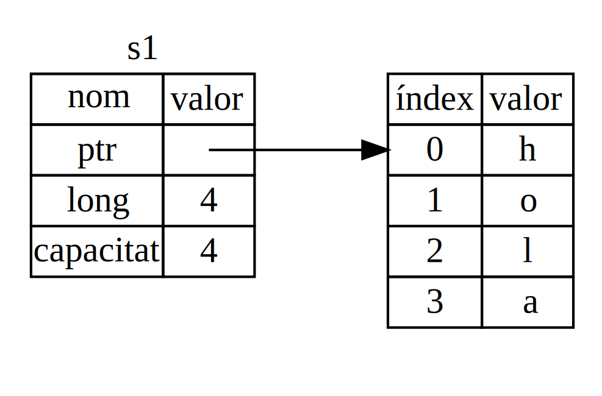
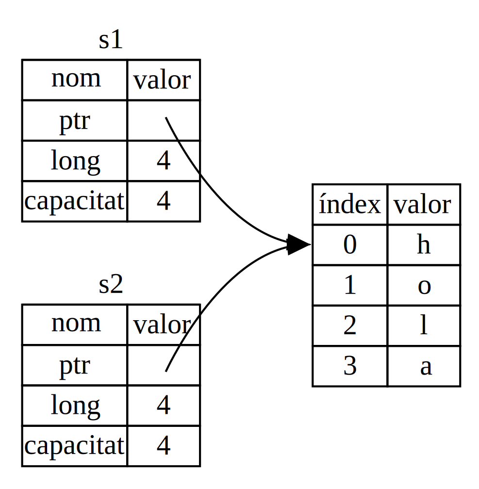
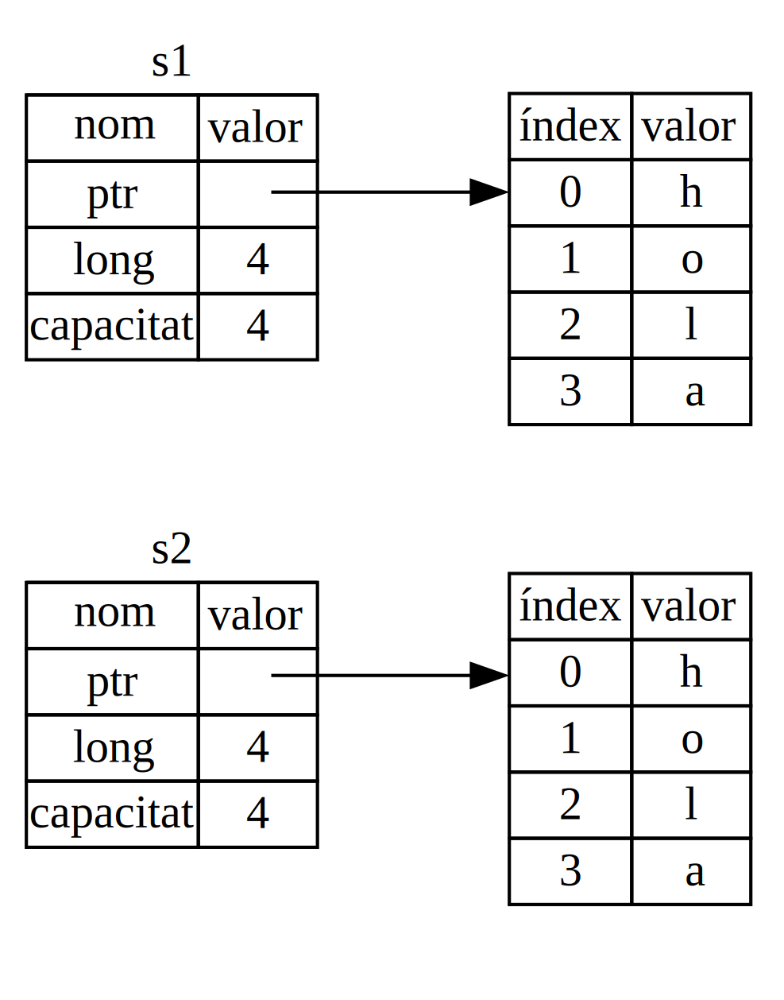
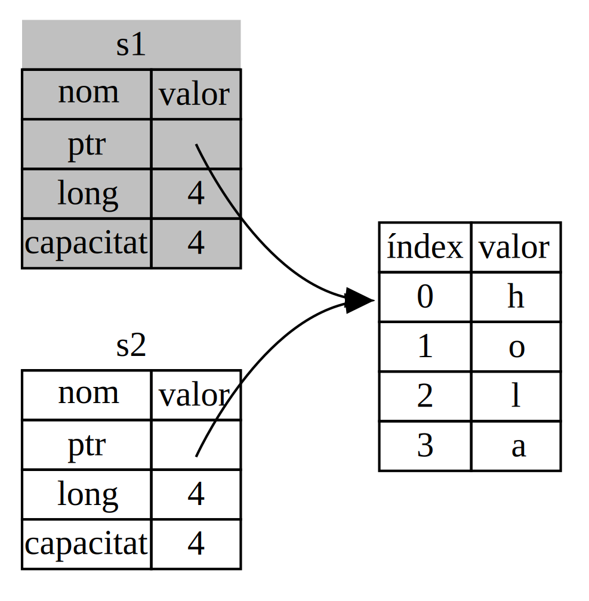

## Què és *Ownership*?

El mecanisme de pertinença o *Ownership* és un conjunt de regles que governen
com un programa en Rust gestiona la memòria. Tots els programes han de manegar
la manera en que fan servir la memòria de l'ordinador quan s'executen. Alguns
llenguatges disposen de recol·lector d'escombraries (*garbage collector*) que
se n'encarrega de gestionar memòria que ja no està en ús per part del programa.
En altres llenguatges, són els programadors els que han de reservar i alliberar
memòria explícitament. Rust fa servir una tercera opció: la memòria es
gestionada per un sistema de pertinença, amb un conjunt de regles que comprova
el compilador. Quan troba que el programa viola una de les regles, no el
compila. Cap de les funcionalitats de *ownership* rellenteix l'execució del
programa.

Donat que el concepte de *ownership* és nou per molts desenvolupadors, sol
costar una mica acostumar-se'n. La bona notícia és que, a mida que guanyem
experiència amb Rust i les regles del sistema de pertinença, anirem trobant més
natural desenvolupar codi segur i eficient. Tingués paciència.

Un cop entenguem el *ownership*, disposarem d'una base sòlida per entendre les
característiques que fan de Rust, un llenguatge únic. En aquest capítol
aprendrem el concepte tot treballant amb exemples focalitzats en una estructura
de dades ben comuna: les cadenes de text o *strings*.

> ### Pila i monticle
>
> Molts llenguatges de programació no ens requereixen pensar massa sovint sobre
> la pila (*stack*) i el monticle (*heap*) Però en un llenguatge de sistemes
> com ara Rust, que un valor estigui a la pila o al monticle afecta en com el
> llenguatge es comporta i en perquè hem de prendre determinades decisions. Més
> tard en aquest capítol es descriurà una part del concepte de pertinença, en
> relació amb la pila i el monticle. Per aquesta raó, a continuació passarem a
> fer-ne una breu explicació.
>
> Tant la pila com el monticle són parts de la memòria disponible per que el
> nostre codi la faci servir en temps d'execució. Són estructurades, però, de
> manera diferent. La pila emmagatzema els valors en l'ordre en que els obté i
> els elimina en ordre invers. Aquesta estructura es descriu com *l'últim que
> entra és el primer que surt* i en anglès es sol coneixer com (*LIFO* - last
> in, first out). Pensem en una pila de plats. Quan hi afegim més plats, els
> col·loquem a dalt de tot de la pila, i quan en traiem, els agafem també del
> cim. Afegir i eliminar plats del mig o la base de la pila no funcionaria tan
> bé! Afegir dades a una pila es coneix com *push*, mentre que de treure'n en
> diem *pop*. Tots els elements que guardem en la pila han de tenir una mida
> coneguda en temps de compilació. Aquelles dades que puguin canviar de midda,
> no podran anar a la pila i caldrà guardar-les al monticle.
>
> El monticle és menys organitzat. Quan hi afegim dades, hem de demanar una
> certa quantitat d'espai. L'assignador de memòria troba un espai lliure en el
> monticle que sigui prou gran, el marca que està en ús, i retorna un *punter*
> que correspon a l'adreça de memòria d'aquella posició. Aquest procés es
> coneix com *assignar al monticle* i, de vegades s'abrevia amb simplement
> *assignar* (afegir valors a la pila no es considera assignar). Donat que el
> punter al monticle té una mida fixa coneguda, podem emmagatzemar-lo a la
> pila, però quan volem aconseguir el valor al que apunta, hem de *seguir* el
> punter. Pensem en com aconseguim lloc a un restaurant. En entrar, demanem
> lloc pel nombre de persones que composa el nostre grup. Llavors el cambrer
> ens troba una taula buida amb prou espai per seure tot el grup. Finalment, el
> cambrer ens dirigeix a la taula trobada. Si algú del grup arriba tard, podrà
> preguntar on trobar-nos.
>
> Afegir a la pila és més ràpid que assignar al munticle, ja que no cal cercar
> per saber on col·locar-hi el nou valor. La nova posició és sempre el cim de
> la pila. En canvi, assignar espai al monticle requereix més feina ja que
> l'assignador ha de cercar un espai prou gran on guardar el valor i ha de
> registrar que està ocupat per posteriors assignacions.
>
> L'accés a les dades en el monticle també és més lent que en la pila, donat
> que cal seguir un punter per arribar-hi. Els processadors actuals van més
> ràpids quan no els cal saltar tant en memòria. Continuant l'analogia,
> considerem que el cambrer del restaurant ha d'agafar comandes de moltes
> taules. És més eficient apuntar totes les comandes d'una taula abans de
> moure's a la següent. Agafar primer una comanda de la taula A, passar a la B
> per una altra i tornar a la A un altre cop per una altra, seria un procés
> molt més lent. Per la mateixa raó, el processador fa millor la seva feina si
> treballa amb dades que es troben a prop d'altres dades, com ara a la pila, en
> comptes de més lluny, com passa al monticle.
>
> Quan el nostre codi crida una funció, els valors que es passen a aquesta
> funció, incloent potencialment punters a dades al monticle, i les variables
> locals de la funció, són afegits al cim de la pila. Quan la funció ha
> finalitzat, aquests valors són eliminats de la pila.
>
> El mecanisme de *ownership* se n'encarrega de portar la comptabilitat de
> quines parts del codi fan servir quines dades al monticle, minimitzant la
> quantitat de dades duplicades al monticle i alliberant-hi espai que ja no es
> fa servir, de manera que no ens quedem sense espai. Un cop entenguem el
> mecanisme de pertinença, no ens caldrà pensar en la pila ni el monticle tant
> sovint. Saber, però, que el principal objectiu del *ownership* és gestionar
> les dades del monticle, ens ajuda a explicar perquè funciona de la manera que
> ho fa.

### Regles de pertinença

En primer lloc, fem una ullada a les regles de pertinença. Mantinguem aquestes
regles al cap així anem passant pels diferents exemples que vindran:

* Cada valor en Rust té un *propietari* (*owner*).
* Només pot haver un propietari a cada moment.
* Quan el propietari mor (queda fora de l'àmbit), el valor serà eliminat.

### Àmbit de les variables

A partir d'ara, com que ja hem vist la sintaxi bàsica d'un programa en Rust, a
partir d'ara ometrem el `fn main() {` dels exemples de codi. Així, si vas
provant-los, recorda afegir-los el `main`. Així els exemples apareixeran una
mica més concisos, permetent-nos focalitzar en els detalls de l'exemple.

Com a primer exemple de pertinença, considerarem l'*àmbit* (en anglès *scope*)
d'algunes variables. L'àmbit és l'interval dins del programa on un element és vàlid. Per exemple:

```rust
let s = "hola";
```

La variable `s` fa referència a un literal de text. És a dir, el valor de la
cadena de text estarà codificat directament en el codi del nostre programa. La
variable és vàlida des del moment en que està declarada fins que finalitza
l'àmbit actual. El llistat 4-1 mostra un programa amb comentaris indicant on
serà vàlida la variable `s`.

```rust
{{#rustdoc_include ../listings/ch04-understanding-ownership/listing-04-01/src/main.rs:here}}
```

<span class="caption">Llistat 4-1: Una variable i l'àmbit en què és vàlida</span>

En altres paraules, hi ha dos punts de temps importants a considerar:

* Quan `s` *entra* en l'àmbit, és vàlida.
* Es manté vàlida fins que *surt* de l'àmbit.

Ara per ara, la relació entre àmbits i la validesa de les variables és similar
a la d'altres llenguatges de programació. Basant-nos en aquest coneixement,
continuarem aprofundint en el concepte amb la introducció del tipus `String`.

### El tipus `String`

Com a exemple d'aplicació de les regles de pertinença, necessitem un tipus de
dades que sigui més complex que aquells que hem vist a la secció [“Tipus de
dades”][data-types]<!-- ignore --> al capítol 3. Els tipus que hem vist fins
ara tenen mida coneguda, poden ser emmagatzemats a la pila i eliminats
d'aquesta quan finalitza el seu àmbit. També poden ser copiats de manera
trivial per crear-ne una nova instància independent de l'anterior, si una altra
part del codi requereix fer servir el mateix valor en un altre àmbit. Ara volem
considerar un tipus de dades que sigui emmagatzemat al montícle i, així,
explorar com sap Rust quan alliberar aquestes dades, `String` és genial per
aquest objectiu.

De moment ens concentrarem en les parts de `String` relacionades amb la
pertinença Aquests aspectes també són vàlids per altres tipus de dades
complexos, siguin inclosos a la llibreria estàndard o bé creats per nosaltres.
Tractarem el tipus `String` en més profunditat al [Capítol 8][ch8]<!-- ignore
-->.

Ja hem conegut els literals de text, en els que un valor de tipus String apareix codificat directament al nostre programa.
Els literals de text són convenients però no són adequats per totes aquelles situacions que voldrem usar text.
Una de les raons és que són immutables. Una altra és que no tots els valors de
tipus string poden conèixer quan escrivim el nostre codi. Per exemple, què
passaria si volguessim obtenir l'entrada dels nostres usuaris i
emmagarzemar-la?
Per situacions com aquesta, Rust disposa d'un segon tipus de cadenes de text, anomenat `String`.
Aquest tipus gestiona les dades assignades al montícle i, com a tal, és capaç d'emmagatzemar una cadena de text de llargària desconeguida en temps de compilació.
És possible crear un `String` a partir d'un literal de text, fent servir la funció `from`, de la següent manera:

```rust
let s = String::from("hola");
```

Els dos punts dobles `::` és un operador que ens permet gestionar l'espai de
noms a partir de la cadena de text, en comptes de requerir-nos alguna funció
especial com ara `string_from`. Tractarem aquesta sintaxi més endavant, a la
secció [“Síntaxi del mètode”][method-syntax]<!-- ignore --> del capítol, així
com de l'ús d'espais de noms a [“Camins per referir-nos a un element en l'arbre
de mòduls”][paths-module-tree]<!-- ignore --> al capítol 7.

Aquesta classe de text **és** mutable:

```rust
{{#rustdoc_include ../listings/ch04-understanding-ownership/no-listing-01-can-mutate-string/src/main.rs:here}}
```

Així, quina és la diferència? Per què podem modificar un valor de tipus
`String` però no de literal de text? La diferència rau en com aquests dos tipus són gestionats en memòria.

### Memòria i assignació

Coneixem els continguts d'un literal de text en temps de compilació. Per aquesta raó, el text pot ser inclós directament a l'executable final. Per aquesta raó els literals són ràpids i eficients. Aquestes característiques tenen com a preu que els literals han de ser immutables. Malauradament no podem reservar un espai indeterminat de memòria dins l'executable, per cada peça de
text de la que no coneixem la mida en temps d'execució i, a sobre, quan aquesta
pot canviar durant l'execució del programa.

〜

Per a poder oferir la possibilitat de modificar i ampliar una peça de test, el
valor del tipus `String` ha de ser guardat al monticle, durant l'execució. Això implica:

* L'assignador de memòria ha de reservar l'espai en temps d'execució.
* Necessitem alguna manera de retornar aquesta memòria a l'assignador, un cop
   ja no ens cal el nostre `String`.

La primera part la realitzem nosaltres quan cridem a `String::from`. La seva
implementació reserva la memòria necessària. Tot plegat és quelcom força universal en els llenguatges de programació.

La segona part, però, és diferent. En llenguatges amb un recol·lector
d'escombraries (*Garbage Collector* o *GC*), el GC va enregistrant i alliberant
la memòria, així deixa de ser usada, de manera que els programadors no ens
n'hem de preocupar. A la majoria dels llenguatges sense GC, un cop sabem que no
necessitem una variable, ens cal alliberar el seu espai explícitament, cosa que
històricament representa un problema complicat si es vol fer bé. Si oblidem alliberar, estem malbaratant memòria. Si ho fem massa d'hora, tenim una variable invàlida. Si ho fem més d'un cop sobre la mateixa memòria, també suposa un error. Per fer-ho bé, ens cal alliberar exactament una vegada cada espai que reservem.

Rust ho resol d'una altra manera: la memòria és automàticament retornada un cop
la variable a qui pertany, surt fora d'àmbit. A continuació veurem una versió de l'exemple del llistat 4-1, tot usant un `String` en comptes d'un literal de
text.

```rust
{{#rustdoc_include ../listings/ch04-understanding-ownership/no-listing-02-string-scope/src/main.rs:here}}
```

Hi ha un moment natural en el que podem retornar la memòria del nostre
`String`: quan `s` surt de l'àmbit. Quan una variable surt d'àmbit, Rust crida una funció especial per nosaltres. Aquesta funció s'anomena [`drop`][drop]<!--
ignore -->, i és el lloc on l'autor de `String` pot col·locar el codi per
retornar l'espai de memòria. Rust crida `drop` automàticament en el moment que
es tanca el claudàtor.

> Nota: En C++, aquest patró d'alliberament de recursos al final del temps de
> vida d'un element s'anomena de vegades *l'adquisició del recurs és la
> inicialització* o, en anglès *Resource Acquisition Is Initialization* (RAII).
> La funció `drop` a Rust resultarà familiar a hom que hagi fet servir el patró RAII.

Aquest patró determina profundament la manera com escrivim codi en Rust. Pot semblar simple ara mateix, però el comportament del codi pot ser
inesperat en situacions més complexes quan vulguem disposar de múltiples
variables usant les dades que hem reservat al monticle. Ara explorarem algunes d'aquestes situacions.

<!-- Old heading. Do not remove or links may break. -->
<a id="ways-variables-and-data-interact-move"></a>

#### Variables i dades interaccionant amb *Move*

Hi ha diferents maneres en Rust en què múltiples variables interaccionen amb la mateixa dada.
Considerem el següent exemple, fent servir un enter, al llistat 4-2.

```rust
{{#rustdoc_include ../listings/ch04-understanding-ownership/listing-04-02/src/main.rs:here}}
```

<span class="caption">Llistat 4-2: Assignació del valor enter de la variable `x` a `y`</span>

Probablement pots deduir què passa en aquest exemple: primer associa el valor
`5` a `x`, després fa una còpia del valor de `x` i l'associa a `y`. En finalitzar, disposem de dues variables `x` i `y` que valen `5`. Això és així perquè els enters són valors simples, de mida fixa i coneguda. Tots dos `5` són afegits a la pila.


Què passarà amb variables de tipus `String`?

```rust
{{#rustdoc_include ../listings/ch04-understanding-ownership/no-listing-03-string-move/src/main.rs:here}}
```

Com que es veu molt similar a l'exemple amb enters, podríem assumir que
funciona de la mateixa manera. És a dir, que la segona línia farà una còpia del
valor de `s1` i l'associarà amb `s2`. Però no és ben bé així com va.

La figura 4-1 ens representa què passa realment amb els valors de tipus
`String`. Un `String` està format per tres parts, que la figura mostra a
l'esquerra: un punter a la posició de memòria que conté el valor de la cadena
de text, la seva longitud i la seva capacitat. Aquestes tres dades es guarden
en la pila. A la dreta de la figura, hi trobem la memòria al monticle, on es
guarden els continguts.



<span class="caption">Figura 4-1: Representació en memòria de la variable `s1`
de tipus `String` amb el valor `"hola"`</span>

〜


La longitud indica quanta memòria, en bytes, usen els continguts del `String`. La capacitat és la quantitat total de memòria, també en bytes, que s'ha reservat al `String`. La diferència entre longitud i capacitat és important, però no en aquest moment. Així, de moment està bé si ignorem la capacitat.

Un cop assignem `s1` a `s2`, el valor del `String` és copiat. És a dir, copiem els valors del punter, la longitud i la capacitat que es troben a la pila. No es copien les dades del monticle a les que el punter fa referència. En altres paraules, la representació de les dades en memòria té l'aspecte indicat a la figura 4-2.



<span class="caption">Figura 4-2: Representació en memòria de la variable `s2`
que té una còpia del punter, la longitud i la capacitat de `s1`</span>

La representació *no* s'assembla a la de la figura 4-3, que és com es veuria si Rust copies també les dades del monticle. Si Rust fes això, l'operació `s2 = s1` seria molt cara en termes d'eficiència en temps d'execució, especialment quan les dades al monticle són voluminoses.



<span class="caption">Figura 4-3: Com es veuria si per `s2 = s1` Rust copiès també les dades del monticle.</span>

Abans hem comentat que quan una variable surt de l'àmbit, Rust automàticament crida la funció `drop` i allibera l'espai assignat del monticle. Però la figura 4-2 mostra com els dos punters fan referència a la mateixa posició. Això representa un problema: quan `s2` i `s1` surten del seu àmbit, Rust hauria d'alliberar la mateixa memòria dues vegades. És el que es coneix com a error de *doble alliberament* i és un dels errors de seguretat de memòria dels que hem parlat. L'alliberament per duplicat de memòria pot portar a corrupció de la memòria, el que pot portar a vulnerabilitats en la seguretat.

Per assegurar la seguretat de la memòria, un cop executada la línia `let s2 = s1;`, Rust considera que la variable `s1` ja no és vàlida. Per tant, Rust no necessita alliberar res quan `s1` surt de l'àmbit. Comprova què passa quan intentem fer servir `s1` després que hagi estat creada `s2`. No funcionarà:

```rust,ignore,does_not_compile
{{#rustdoc_include ../listings/ch04-understanding-ownership/no-listing-04-cant-use-after-move/src/main.rs:here}}
```

Obtenim el següent error perquè Rust evitarà que fem servir una referència invalidada:

```console
{{#include ../listings/ch04-understanding-ownership/no-listing-04-cant-use-after-move/output.txt}}
```

Si has sentit els termes *còpia superficial* (*shallow copy*) i *còpia profunda* (*deep copy*) treballant amb altres llenguatges de programació, el concepte de copiar el punter, la longitud i la capacitat, sense copiar el text apuntat, probablement et sonarà com realitzar una còpia superficial. Però, com que Rust també invalida la primera variable, en comptes d'anomenar-la una còpia superficial, li diem *moure* (*move*). En aquest exemple direm que `s1` ha estat
*moguda* a `s2`. La figura 4-4 mostra el que en realitat passa.



<span class="caption">Figura 4-4: Representació en memòria un cop `s1` ha estat invalidada</span>

Això resol el nostre problema! Ara que només és vàlida `s2`, quan surti del seu àmbit només serà alliberada la memòria per aquesta variable.

Hi ha una decisió de disseny implícita darrera d'això: Rust mai no farà còpies "profundes" de les nostres dades. Per tant, tota còpia *automàtica*
es pot suposar que serà econòmica en temps d'execució.

<!-- Old heading. Do not remove or links may break. -->
<a id="ways-variables-and-data-interact-clone"></a>

#### Variables i dades interaccionant amb *Clone*

Si *realment* volem copiar en profunditat les dades del `String` que es troben guardades al monticle, i no només les dades guardades a la pila, podem fer servir un mètode anomenat `clone`. Tractarem la sintaxi dels mètodes en el capítol 5, però donat que els mètodes són una característica comuna en molts llenguatges de programació, segurament ja els coneixes.

Veiem el mètode `clone` en funcionament:

```rust
{{#rustdoc_include ../listings/ch04-understanding-ownership/no-listing-05-clone/src/main.rs:here}}
```

L'exemple funciona i produeix explícitament el comportament representat per la figura 4-3,
on les dades del monticle resulten *copiades*.

Quan ens trobem amb una crida al mètode `clone`, sabem que darrere s'executarà un codi i que aquest podria ser costós. És un senyal visual que ens indica que alguna cosa diferent està passant.

#### Dades només en la pila: Copy

Hi ha una altra consideració que no hem tractat encara. El codi que fa servir enters
—part va ser mostrat al llistat 4-2—funciona i és vàlid:

```rust
{{#rustdoc_include ../listings/ch04-understanding-ownership/no-listing-06-copy/src/main.rs:here}}
```

Semblaria que aquest codi contradiu el que acabem d'aprendre: no hem cridat el mètode
`clone` i `x` continua sent vàlida; és a dir, el seu valor no s'ha mogut a `y`.

L'explicació és que els tipus com ara enters, que presenten una mida coneguda en temps de compilació, són emmagatzemats completament en la pila. Així les còpies dels seus valors es realitzen ràpides. Això significa que no hi ha cap raó per la qual podríem voler evitar que `x` seguís sent vàlid un cop inicialitzada la variable `y`. En altres paraules, aquí no hi ha diferència entre còpia superficial i profunda. Per tant, cridar `clone` no faria cap diferència respecte la còpia superficial i, per tant, ens la podem estalviar.

Rust disposa d'una notació especial anomenada el tret (*trait*) `Copy` que podrem assignar a tipus de dades que estan emmagatzemats a la pila, com ara els enters. En parlarem més sobre *traits* al
[capítol 10][traits]<!-- ignore -->). Si un tipus implementa el tret `Copy`, les variables d'aquest no mouran la pertinença del seu valor, sinó que faran una còpia superficial d'aquest. Tot plegat, farà que aquestes variables continuïn sent vàlides després de l'assignació a una altra variable.

Rust no ens permetra anotar un tipus amb el tret `Copy` si el tipus, o alguna de les seves parts, té implementat el tret `Drop`. Si el tipus necessita un comportament especial quan els valors surten d'àmbit, i li afegim el tret `Copy`, obtindrem un error en temps de compilació. Aprendrem com afegir l'anotació `Copy` als nostres tipus per implementar el tret a
[“Trets derivables”][derivable-traits]<!-- ignore --> a l'apèndix C.

Així, quins tipus implementen el tret `Copy`? Sempre podem consultar la documentació del corresponent tipus per estar segurs. No obstant, com a regla general, tot grup de valors escalars simples poden implementar el tret `Copy`, mentre que cap tipus que requereixi assignació de memòria o sigui algun tipus de recurs, podrà implementar `Copy`. A continuació, veiem alguns dels tipus que implementen `Copy`:

* Tots els tipus enters, com ara `u32`.
* El tipus Boolean `bool`, amb els seus valors `true` i `false`.
* Tots els tipus de coma flotant, com ara `f64`.
* El tipus caracter, `char`.
* Les tuples, sempre i quant només continguin elements de tipus que també implementin `Copy`. Per exemple, `(i32, i32)` implementa `Copy`, mentre que `(i32, String)` no ho fa.

### Pertinença i funcions

La manera de passar un valor a una funció és similar al d'assignar un valor a una variable. Quan passem una variable a una funció, el seu valor serà mogut o copiat de la mateixa manera que ho seria si fos assignada a una altra variable. El llistat 4-3 presenta un exemple amb anotacions que mostren on les variables entren i surten del seu àmbit.

<span class="filename">Filename: src/main.rs</span>

```rust
{{#rustdoc_include ../listings/ch04-understanding-ownership/listing-04-03/src/main.rs}}
```

<span class="caption">Llistat 4-3: Funcions amb pertinença i anotacions d'àmbit</span>

Si intentessim fer servir `s` un cop cridat `mou()`, Rust llançaria un error de compilació. Aquestes comprovacions estàtiques ens protegeixen d'errors. Intentem afegir codi al `main()` que faci servir `s` i `x` per comprovar quan els podem fer servir i quan les regles de pertinença ens ho impedeixen.

### Valors de retorn i àmbit

També es pot transferir la pertinença quan retornem valors. El llistat 4-4 mostra un exemple de funció que retorna un valor, amb anotacions similars a les del llistat 4-3.

<span class="filename">Filename: src/main.rs</span>

```rust
{{#rustdoc_include ../listings/ch04-understanding-ownership/listing-04-04/src/main.rs}}
```

<span class="caption">Llistat 4-4: Transferint la pertinença dels valors de retorn</span>

La pertinença d'una variable segueix el mateix patró cada cop: assignar el valor a una altra variable el mou. Quan una variable que inclou dades al monticle surt d'àmbit, el valor serà alliberat amb `drop` a menys que la pertinença de les dades hagi estat moguda a una altra variable.

Malgrat això funciona, obtenir la pertinença i retornar-la a cada funció resulta una mica tediós. Què passaria si ens interesés permetre que una funció fes servir un valor però no passar la pertinença? Resulta una mica incòmode que allò que passem a la funció, hagi de ser retornat si el volem fer servir novament, juntament amb qualsevol altra dada que la funció requereixi retornar també.

Rust ens permet retornar múltiples valors fent servir una tupla, com es pot veure al llistat 4-5.

<span class="filename">Filename: src/main.rs</span>

```rust
{{#rustdoc_include ../listings/ch04-understanding-ownership/listing-04-05/src/main.rs}}
```

<span class="caption">Llistat 4-5: Retornant la pertinença dels paràmetres</span>

Però tot plegat resulta en massa ceremònia i un munt de feina per un concepte tan habitual. Per sort, Rust ofereix una característica que permet usar un valor sense transferir la pertinença: es diu *referències*.

[data-types]: ch03-02-data-types.html#data-types
[ch8]: ch08-02-strings.html
[traits]: ch10-02-traits.html
[derivable-traits]: appendix-03-derivable-traits.html
[method-syntax]: ch05-03-method-syntax.html#method-syntax
[paths-module-tree]: ch07-03-paths-for-referring-to-an-item-in-the-module-tree.html
[drop]: ../std/ops/trait.Drop.html#tymethod.drop
