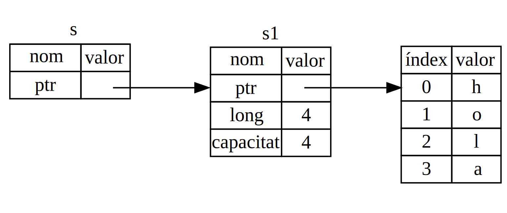

## Referències i prestec

El problema amb l'ús de tuples al codi del llistat 4-5 és que ens veiem forçats a retornar el
`String` a la funció que crida, de manera que aquesta pugui continuar utilitzant-lo un cop cridat `calcula_longitud()`, ja que el `String` ha estat mogut a
`calcula_longitud()`. En comptes d'això, podem oferir una referència al valor del `String`.
Una *referència* iés una mena d'apuntador a una posició de memòria, que podem seguir per arribar al valor emmagatzemat en aquesta adreça, i que pertany a una altra variable.
A diferència dels punters, està garantit que les referències apunten un valor vàlid d'un tipus determinat durant la vida de la referència.

A continuació es mostra com definirem i usarem la funció `calcula_longitud` que té un paràmetre que fa referència a un objecte en comptes de prendre possessió del valor:

<span class="filename">Filename: src/main.rs</span>

```rust
{{#rustdoc_include ../listings/ch04-understanding-ownership/no-listing-07-reference/src/main.rs:all}}
```

En primer lloc, fixat que tant el codi de la tupla en la declaració de la variable i en el valor de retorn de la funció, han desaparegut. En segon lloc, nota que passem `&s1` a
`calcula_longitud()` i, en la seva definició, obtenim un `&String` en comptes d'un
`String`. Els ampersands representen *referències*, i permeten referir-nos a un valor sense prendre'n possessió. La figura 4-5 il·lustra aquest concepte.



<span class="caption">Figura 4-5: Un diagrama de `&String s` apuntant a `String
s1`</span>

> Nota: L'oposat a referenciar amb `&` és *dereferenciar*. Cosa que s'aconsegueix amb l'operador de derreferenciació,  `*`. Veurem més usos de l'operador de dereferenciació al capítol 8, i discutirem els detalls de la referenciació al capítol 15.

Fixem-nos amb més detall a la crida en la funció:

```rust
{{#rustdoc_include ../listings/ch04-understanding-ownership/no-listing-07-reference/src/main.rs:here}}
```

La sintaxi `&s1` ens permet crear una referència que *apunta* al valor de `s1`
però que no pren la propietat. Donat que el valor no li pertany, no serà eliminat quan la referencia deixi de ser usada.

De la mateixa manera, la signatura de la funció fa servir `&` per indicar que el tipus del paràmetre `s`  és una referència. Afegim-hi algunes anotacions explicatives:

```rust
{{#rustdoc_include ../listings/ch04-understanding-ownership/no-listing-08-reference-with-annotations/src/main.rs:here}}
```

The scope in which the variable `s` is valid is the same as any function
parameter’s scope, but the value pointed to by the reference is not dropped
when `s` stops being used, because `s` doesn’t have ownership. When functions
have references as parameters instead of the actual values, we won’t need to
return the values in order to give back ownership, because we never had
ownership.

We call the action of creating a reference *borrowing*. As in real life, if a
person owns something, you can borrow it from them. When you’re done, you have
to give it back. You don’t own it.

So, what happens if we try to modify something we’re borrowing? Try the code in
Listing 4-6. Spoiler alert: it doesn’t work!

<span class="filename">Filename: src/main.rs</span>

```rust,ignore,does_not_compile
{{#rustdoc_include ../listings/ch04-understanding-ownership/listing-04-06/src/main.rs}}
```

<span class="caption">Llistat 4-6: Attempting to modify a borrowed value</span>

Here’s the error:

```console
{{#include ../listings/ch04-understanding-ownership/listing-04-06/output.txt}}
```

Just as variables are immutable by default, so are references. We’re not
allowed to modify something we have a reference to.

### Mutable References

We can fix the code from Listing 4-6 to allow us to modify a borrowed value
with just a few small tweaks that use, instead, a *mutable reference*:

<span class="filename">Filename: src/main.rs</span>

```rust
{{#rustdoc_include ../listings/ch04-understanding-ownership/no-listing-09-fixes-listing-04-06/src/main.rs}}
```

First we change `s` to be `mut`. Then we create a mutable reference with `&mut
s` where we call the `change` function, and update the function signature to
accept a mutable reference with `some_string: &mut String`. This makes it very
clear that the `change` function will mutate the value it borrows.

Mutable references have one big restriction: if you have a mutable reference to
a value, you can have no other references to that value. This code that
attempts to create two mutable references to `s` will fail:

<span class="filename">Filename: src/main.rs</span>

```rust,ignore,does_not_compile
{{#rustdoc_include ../listings/ch04-understanding-ownership/no-listing-10-multiple-mut-not-allowed/src/main.rs:here}}
```

Here’s the error:

```console
{{#include ../listings/ch04-understanding-ownership/no-listing-10-multiple-mut-not-allowed/output.txt}}
```

This error says that this code is invalid because we cannot borrow `s` as
mutable more than once at a time. The first mutable borrow is in `r1` and must
last until it’s used in the `println!`, but between the creation of that
mutable reference and its usage, we tried to create another mutable reference
in `r2` that borrows the same data as `r1`.

The restriction preventing multiple mutable references to the same data at the
same time allows for mutation but in a very controlled fashion. It’s something
that new Rustaceans struggle with because most languages let you mutate
whenever you’d like. The benefit of having this restriction is that Rust can
prevent data races at compile time. A *data race* is similar to a race
condition and happens when these three behaviors occur:

* Two or more pointers access the same data at the same time.
* At least one of the pointers is being used to write to the data.
* There’s no mechanism being used to synchronize access to the data.

Data races cause undefined behavior and can be difficult to diagnose and fix
when you’re trying to track them down at runtime; Rust prevents this problem by
refusing to compile code with data races!

As always, we can use curly brackets to create a new scope, allowing for
multiple mutable references, just not *simultaneous* ones:

```rust
{{#rustdoc_include ../listings/ch04-understanding-ownership/no-listing-11-muts-in-separate-scopes/src/main.rs:here}}
```

Rust enforces a similar rule for combining mutable and immutable references.
This code results in an error:

```rust,ignore,does_not_compile
{{#rustdoc_include ../listings/ch04-understanding-ownership/no-listing-12-immutable-and-mutable-not-allowed/src/main.rs:here}}
```

Here’s the error:

```console
{{#include ../listings/ch04-understanding-ownership/no-listing-12-immutable-and-mutable-not-allowed/output.txt}}
```

Whew! We *also* cannot have a mutable reference while we have an immutable one
to the same value.

Users of an immutable reference don’t expect the value to suddenly change out
from under them! However, multiple immutable references are allowed because no
one who is just reading the data has the ability to affect anyone else’s
reading of the data.

Note that a reference’s scope starts from where it is introduced and continues
through the last time that reference is used. For instance, this code will
compile because the last usage of the immutable references, the `println!`,
occurs before the mutable reference is introduced:

```rust,edition2021
{{#rustdoc_include ../listings/ch04-understanding-ownership/no-listing-13-reference-scope-ends/src/main.rs:here}}
```

The scopes of the immutable references `r1` and `r2` end after the `println!`
where they are last used, which is before the mutable reference `r3` is
created. These scopes don’t overlap, so this code is allowed: the compiler can
tell that the reference is no longer being used at a point before the end of
the scope.

Even though borrowing errors may be frustrating at times, remember that it’s
the Rust compiler pointing out a potential bug early (at compile time rather
than at runtime) and showing you exactly where the problem is. Then you don’t
have to track down why your data isn’t what you thought it was.

### Dangling References

In languages with pointers, it’s easy to erroneously create a *dangling
pointer*—a pointer that references a location in memory that may have been
given to someone else—by freeing some memory while preserving a pointer to that
memory. In Rust, by contrast, the compiler guarantees that references will
never be dangling references: if you have a reference to some data, the
compiler will ensure that the data will not go out of scope before the
reference to the data does.

Let’s try to create a dangling reference to see how Rust prevents them with a
compile-time error:

<span class="filename">Filename: src/main.rs</span>

```rust,ignore,does_not_compile
{{#rustdoc_include ../listings/ch04-understanding-ownership/no-listing-14-dangling-reference/src/main.rs}}
```

Here’s the error:

```console
{{#include ../listings/ch04-understanding-ownership/no-listing-14-dangling-reference/output.txt}}
```

This error message refers to a feature we haven’t covered yet: lifetimes. We’ll
discuss lifetimes in detail in Chapter 10. But, if you disregard the parts
about lifetimes, the message does contain the key to why this code is a problem:

```text
this function's return type contains a borrowed value, but there is no value
for it to be borrowed from
```

Let’s take a closer look at exactly what’s happening at each stage of our
`dangle` code:

<span class="filename">Filename: src/main.rs</span>

```rust,ignore,does_not_compile
{{#rustdoc_include ../listings/ch04-understanding-ownership/no-listing-15-dangling-reference-annotated/src/main.rs:here}}
```

Because `s` is created inside `dangle`, when the code of `dangle` is finished,
`s` will be deallocated. But we tried to return a reference to it. That means
this reference would be pointing to an invalid `String`. That’s no good! Rust
won’t let us do this.

The solution here is to return the `String` directly:

```rust
{{#rustdoc_include ../listings/ch04-understanding-ownership/no-listing-16-no-dangle/src/main.rs:here}}
```

This works without any problems. Ownership is moved out, and nothing is
deallocated.

### The Rules of References

Let’s recap what we’ve discussed about references:

* At any given time, you can have *either* one mutable reference *or* any
   number of immutable references.
* References must always be valid.

Next, we’ll look at a different kind of reference: slices.
