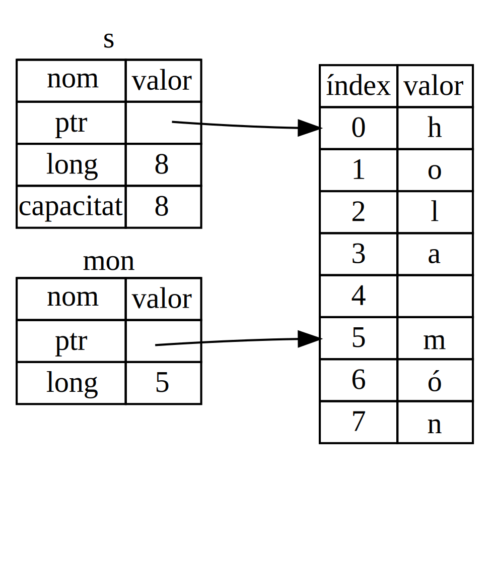

## El tipus secció

Les *seccions* (en anglès *slices*) permeten referenciar una seqüència contigua d'elements en una col·lecció, en comptes de tota la col·lecció.\ Uan secció és un tipus de referència i, per tant, no té pertinença.

Fem un petit exercici de programació: escriu una funció que prengui un text format per paraules separades per espais, i retorni la pimera paraula que trobi al text.
Si la funció no troba un espai al string, retornarà tota la cadena ja que tota ella serà una paraula.

Comencem veient com escriuríem la signatura de la funció sense fer ús de seccions, i així podrem entendre quin és el problema que resolen les seccions:

```rust,ignore
fn primera_paraula(s: &String) -> ?
```

La funció `primera_paraula` espera un `&String` com a paràmetre. No volem adquirir la pertinença d'aquest string, així que amb la referència ja està bé.\ Ara, però què és el que hauríem de retornar? En realitat, no disposem d'una manera de parlar sobre una *part* d'un string. No obstant, sempre podem retornar l'índex del final de la paraula, indicat per un espai. Intentem això al llistat 4-7.

<span class="filename">Fitxer: src/main.rs</span>

```rust
{{#rustdoc_include ../listings/ch04-understanding-ownership/listing-04-07/src/main.rs:here}}
```

<span class="caption">Llistat 4-7: La funció `primera_paraula` que retorna el valor de la posició del paràmetre `String`</span>

Com que ens cal atravesar el `String` element a element i comprovar si la posició correspon o no a un espai, convertirem el nostre `String` a una seqüència (array) de bytes, fent servir el mètode
`as_bytes`.

```rust,ignore
{{#rustdoc_include ../listings/ch04-understanding-ownership/listing-04-07/src/main.rs:as_bytes}}
```

A continuació, creem un iterador sobre l'array de bytes, fent servir el mètode `iter`:

```rust,ignore
{{#rustdoc_include ../listings/ch04-understanding-ownership/listing-04-07/src/main.rs:iter}}
```

Veurem els iteradors amb més detall al [capítol 13][ch13]<!-- ignore -->.
De moment, simplement entenguem que `iter` és un mètode que retorna cada element d'una col·lecció i que `enumerate` transforma el resultat de `iter` de manera que cada element and returns each element formi part d'una tupla. El primer element de cada tupla retornada per
`enumerate` és l'índex, mentre que el segon correspon a la referència a l'element corresponent a l'array de bytes.
És una mica més adequat que haver d'anar calculant l'índex.

Com que el mètode `enumerate` retorna una tupla, podem fer servir patrons per desestructurar-la. Veurem més sobre patrons al [capítol
6][ch6]<!-- ignore -->. Al bucle `for` especifiquem el patró que té `i`
com a índex i `&item` com la referència al byte.
Donat que obtenim una referència a l'element des de `.iter().enumerate()`, hem de fer servir `&` al patró.

Dins del bucle `for` cerquem pel byte que representa l'espai tot usant la síntaxi literal. Si trobem un espai, retornem la seva posició.
Altrament retornem la longitud del string fent servir `s.len()`.

```rust,ignore
{{#rustdoc_include ../listings/ch04-understanding-ownership/listing-04-07/src/main.rs:inside_for}}
```

Ara tenim una manera de trobar l'índex del final de la primera paraula dins el string. Encara hi ha, però, un problema. Estem retornant un valor `usize` que només té significat en el context de `&String`. En altres paraules, com que es tracta d'un valor separat del `String`, no hi ha cap garantia de que aquest encara sigui vàlid en el futur. Considerem el programa de lllistat 4-8 que fa servir la funció `primera_paraula` del llistat 4-7.

<span class="filename">Fitxer: src/main.rs</span>

```rust
{{#rustdoc_include ../listings/ch04-understanding-ownership/listing-04-08/src/main.rs:here}}
```

<span class="caption">Llistat 4-8: Guardem el resultat de la funció
`primera_paraula` i a continuació modifiquem el contingut del `String`</span>

Aquest programa compila sense cap error i permetrà l'ús de `paraula` un cop cridat
`s.clear()`. Donat que el valor de `paraula` no està connectat a l'estat de `s`, `paraual` encara conté el valor `4`. Podem fer servir el valor `4` amb la variable `s` per intentar obtenir la primera paraula, però això suposaria un error ja que el contingut de `s` ha canviat després d'assignar `4` a `paraula`.

Haver-se de preocupar de si el valor de `paraula` es torna invalid quan canvia el contingut de
`s` és tediós i és molt fàcil que ens equivoquem! Encara és més delicat gestionar aquests indexos si escrivim la funció `segona_paraula`. La seva signatura hauria de tenir el següent aspecte:

```rust,ignore
fn segona_paraula(s: &String) -> (usize, usize) {
```

Ara estarem controlant l'índex d'inici *i* l'índex de final, i disposem de més valor encara que hem calculat de les dades en un determinat estat però que no estan associades a aquest estat. Disposem de tres variables no relacionades que cal que mantinguem sincronitzades.

Per sort, Rust ens ofereix una solució a aquest problema: seccions de string.

### Seccions de Strings

Una *secció de string* és una referència a part d'un `String`, i té el següent aspecte:

```rust
{{#rustdoc_include ../listings/ch04-understanding-ownership/no-listing-17-slice/src/main.rs:here}}
```

En comptes d'una referència a tot el `String`, `hola` és una referència a una porció d'aquest `String`, especificada en la part extra `[0..4]`. Per crear seccions, fem servir rangs entre claudàtors, tot especificant `[índex_inicial..índex_final]`,
on `índex_inicial` és la primera posició en la secció i `índex_final` is
és la posició després a la darrera de la secció. Internament, l'estructura de dades d'una secció emmagatzema la posició inicial i la longitud de la secció que es correspon amb `índex_final` menys `índex_inicial`. Així, en el cas de `let
mon = &s[5..8];`, `mon` seria una secció que conté un punter al byte de la posició 5 de `s` amb una longitud de `3`.

La figura 4-6 ho mostra en forma de diagrama.



<span class="caption">Figure 4-6: String slice referring to part of a
`String`</span>

With Rust’s `..` range syntax, if you want to start at index 0, you can drop
the value before the two periods. In other words, these are equal:

```rust
let s = String::from("hello");

let slice = &s[0..2];
let slice = &s[..2];
```

By the same token, if your slice includes the last byte of the `String`, you
can drop the trailing number. That means these are equal:

```rust
let s = String::from("hello");

let len = s.len();

let slice = &s[3..len];
let slice = &s[3..];
```

You can also drop both values to take a slice of the entire string. So these
are equal:

```rust
let s = String::from("hello");

let len = s.len();

let slice = &s[0..len];
let slice = &s[..];
```

> Note: String slice range indices must occur at valid UTF-8 character
> boundaries. If you attempt to create a string slice in the middle of a
> multibyte character, your program will exit with an error. For the purposes
> of introducing string slices, we are assuming ASCII only in this section; a
> more thorough discussion of UTF-8 handling is in the [“Storing UTF-8 Encoded
> Text with Strings”][strings]<!-- ignore --> section of Chapter 8.

With all this information in mind, let’s rewrite `primera_paraula` to return a
slice. The type that signifies “string slice” is written as `&str`:

<span class="filename">Fitxer: src/main.rs</span>

```rust
{{#rustdoc_include ../listings/ch04-understanding-ownership/no-listing-18-first-word-slice/src/main.rs:here}}
```

We get the index for the end of the word the same way we did in Listing 4-7, by
looking for the first occurrence of a space. When we find a space, we return a
string slice using the start of the string and the index of the space as the
starting and ending indices.

Now when we call `primera_paraula`, we get back a single value that is tied to the
underlying data. The value is made up of a reference to the starting point of
the slice and the number of elements in the slice.

Returning a slice would also work for a `segona_paraula` function:

```rust,ignore
fn segona_paraula(s: &String) -> &str {
```

Disposem d'una utilitat molt més robusta ja que el compilador se n'encarregarà de garantir que les referències a `String` es mantinguin vàlides. Recordem l'error del programa al llistat
4-8, en el que obteníem l'índex al final de la primera paraula però que tot seguit buidàvem el string de manera que el nostre índex era invàlid? Aquell codi era incorrecte des d'un punt de vista lògic però el compilador no mostrava cap error. El problema acavaria apareixen més tard quan intentèssim fer servir l'índex de la primera paraula en el string buidat. Les seccions fan que aquest tipus d'error sigui impossible i ens permeten saber molt abans que el nostre codi presenta aquest tipus de problemes. La versió de la funció `primera_paraula` que fa servir seccions, generarà un error de compilació:

<span class="filename">Fitxer: src/main.rs</span>

```rust,ignore,does_not_compile
{{#rustdoc_include ../listings/ch04-understanding-ownership/no-listing-19-slice-error/src/main.rs:here}}
```

Aquest és l'error de compilació:

```console
{{#include ../listings/ch04-understanding-ownership/no-listing-19-slice-error/output.txt}}
```

Recall from the borrowing rules that if we have an immutable reference to
something, we cannot also take a mutable reference. Because `clear` needs to
truncate the `String`, it needs to get a mutable reference. The `println!`
after the call to `clear` uses the reference in `word`, so the immutable
reference must still be active at that point. Rust disallows the mutable
reference in `clear` and the immutable reference in `word` from existing at the
same time, and compilation fails. Not only has Rust made our API easier to use,
but it has also eliminated an entire class of errors at compile time!

<!-- Old heading. Do not remove or links may break. -->
<a id="string-literals-are-slices"></a>

#### String Literals as Slices

Recall that we talked about string literals being stored inside the binary. Now
that we know about slices, we can properly understand string literals:

```rust
let s = "Hello, world!";
```

The type of `s` here is `&str`: it’s a slice pointing to that specific point of
the binary. This is also why string literals are immutable; `&str` is an
immutable reference.

#### String Slices as Parameters

Knowing that you can take slices of literals and `String` values leads us to
one more improvement on `primera_paraula`, and that’s its signature:

```rust,ignore
fn primera_paraula(s: &String) -> &str {
```

A more experienced Rustacean would write the signature shown in Listing 4-9
instead because it allows us to use the same function on both `&String` values
and `&str` values.

```rust,ignore
{{#rustdoc_include ../listings/ch04-understanding-ownership/listing-04-09/src/main.rs:here}}
```

<span class="caption">Llistat 4-9: Improving the `primera_paraula` function by using
a string slice for the type of the `s` parameter</span>

If we have a string slice, we can pass that directly. If we have a `String`, we
can pass a slice of the `String` or a reference to the `String`. This
flexibility takes advantage of *deref coercions*, a feature we will cover in
[“Implicit Deref Coercions with Functions and
Methods”][deref-coercions]<!--ignore--> section of Chapter 15.

Defining a function to take a string slice instead of a reference to a `String`
makes our API more general and useful without losing any functionality:

<span class="filename">Fitxer: src/main.rs</span>

```rust
{{#rustdoc_include ../listings/ch04-understanding-ownership/listing-04-09/src/main.rs:usage}}
```

### Other Slices

String slices, as you might imagine, are specific to strings. But there’s a
more general slice type too. Consider this array:

```rust
let a = [1, 2, 3, 4, 5];
```

Just as we might want to refer to part of a string, we might want to refer to
part of an array. We’d do so like this:

```rust
let a = [1, 2, 3, 4, 5];

let slice = &a[1..3];

assert_eq!(slice, &[2, 3]);
```

This slice has the type `&[i32]`. It works the same way as string slices do, by
storing a reference to the first element and a length. You’ll use this kind of
slice for all sorts of other collections. We’ll discuss these collections in
detail when we talk about vectors in Chapter 8.

## 〜 Summary

The concepts of ownership, borrowing, and slices ensure memory safety in Rust
programs at compile time. The Rust language gives you control over your memory
usage in the same way as other systems programming languages, but having the
owner of data automatically clean up that data when the owner goes out of scope
means you don’t have to write and debug extra code to get this control.

Ownership affects how lots of other parts of Rust work, so we’ll talk about
these concepts further throughout the rest of the book. Let’s move on to
Chapter 5 and look at grouping pieces of data together in a `struct`.

[ch13]: ch13-02-iterators.html
[ch6]: ch06-02-match.html#patterns-that-bind-to-values
[strings]: ch08-02-strings.html#storing-utf-8-encoded-text-with-strings
[deref-coercions]: ch15-02-deref.html#implicit-deref-coercions-with-functions-and-methods
